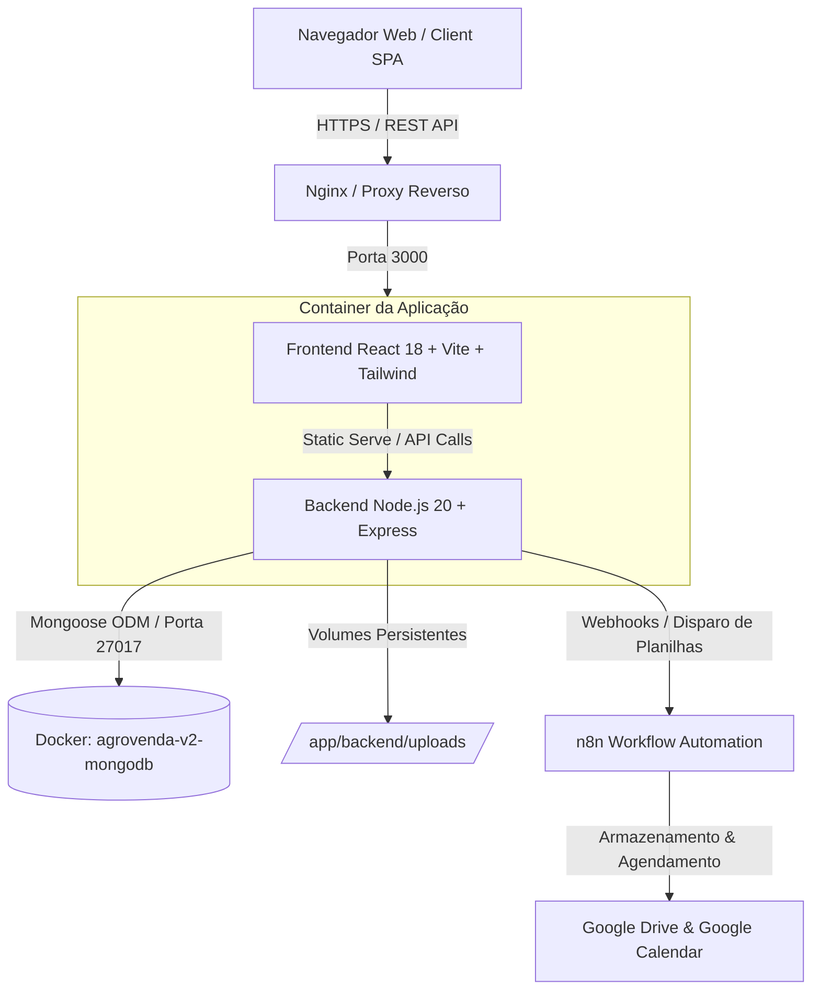
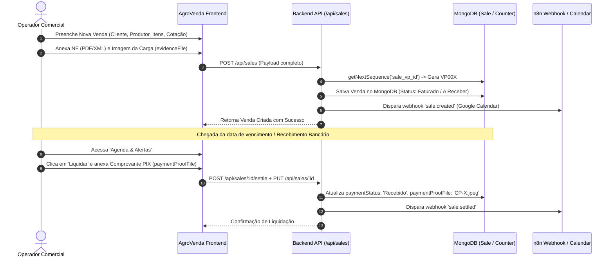

# 🌾 AgroVenda V2 — Documentação de Arquitetura, Rotas, Fluxos e Banco de Dados

> **Versão do Sistema:** 2.0.0 (Enterprise Agrotech)  
> **Data de Atualização:** Setembro / 2026  
> **Finalidade:** Guia Técnico Completo de Auditoria Operacional, Mapeamento de Rotas e Integridade de Dados.

---

## 📑 Sumário

1. [Visão Geral da Arquitetura](#1-visão-geral-da-arquitetura)
2. [Ciclo de Vida Operacional & Fluxos de Negócio](#2-ciclo-de-vida-operacional--fluxos-de-negócio)
3. [Modelagem de Dados & Schemas (MongoDB)](#3-modelagem-de-dados--schemas-mongodb)
4. [Mapeamento Completo de Rotas Backend (REST API)](#4-mapeamento-completo-de-rotas-backend-rest-api)
5. [Mapeamento de Telas e Componentes Frontend](#5-mapeamento-de-telas-e-componentes-frontend)
6. [Regras de Negócio, Fórmulas & Conciliação Contábil](#6-regras-de-negócio-fórmulas--conciliação-contábil)
7. [Matriz e Checklist para Auditoria do Sistema](#7-matriz-e-checklist-para-auditoria-do-sistema)

---

## 1. Visão Geral da Arquitetura

O **AgroVenda V2** é uma plataforma distribuída construída para gestão comercial, pesagem de colheita, conciliação fiscal (NF-e/Danfe), controle de liquidações financeiras e apuração de comissões no setor hortifrúti.

### 🏗️ Stack Tecnológica



* **Frontend:** React 18, Vite, Tailwind CSS, Lucide Icons, Fetch API nativo.
* **Backend:** Node.js 20, Express, Mongoose 8, Multer (Uploads), JWT Auth (JSON Web Tokens), Bcrypt.js.
* **Banco de Dados:** MongoDB 7.x com réplicas/volumes persistentes e índices otimizados (B-Tree).
* **Infraestrutura:** Docker & Docker Compose com isolamento de rede (`agrovenda_v2_network`).
* **Integrações Externas:** n8n Webhooks (Google Drive Spreadsheet Auto-Exporter e Google Calendar Sync).

---

## 2. Ciclo de Vida Operacional & Fluxos de Negócio

### 🔄 Fluxo 1: Da Criação da Venda até a Liquidação Financeira



### 📁 Separação Estrita de Anexos (Arquitetura de Arquivos)

1. **`nfFile` (Nota Fiscal):** Arquivo PDF ou XML oficial da SEFAZ emitido contra o comprador.
2. **`evidenceFile` (Anexo / Imagem da Venda):** Foto da carga, romaneio da fazenda ou canhoto físico registrado no ato da venda.
3. **`paymentProofFile` (Comprovante de Liquidação):** Comprovante bancário/PIX anexado na tela de liquidação da Agenda & Alertas.

---

## 3. Modelagem de Dados & Schemas (MongoDB)

O banco de dados `agrovenda` possui as seguintes coleções principais modeladas via Mongoose:

### 1. Coleção: `sales` (Vendas & Contratos)
| Campo | Tipo | Descrição |
| :--- | :--- | :--- |
| `id` | String (Unique) | Código sequencial da Venda (ex: `VP001`, `VP002`) |
| `operationType` | String | Tipo de operação (`Intermediação`, `Venda Particular`, `Revenda`) |
| `saleDate` | String (`YYYY-MM-DD`) | Data da emissão/saída da mercadoria |
| `client` | String (Indexed) | Razão social / Nome do comprador |
| `clientDocument` | String | CNPJ/CPF do comprador |
| `origin` | String | Produtor Rural e Fazenda de Origem |
| `destCity` / `destUF`| String | Destino da mercadoria |
| `notes` | String | Observações operacionais, cotação e vencimento |
| `nfFile` | String | Nome do arquivo PDF da Nota Fiscal |
| `nfeKey` | String (Indexed) | Chave de 44 dígitos da NF-e |
| `evidenceFile` | String | Imagem anexada na Venda (foto da carga / canhoto) |
| `paymentProofFile` | String | Comprovante de Pagamento/PIX da Liquidação |
| `items` | Array de Objetos | Discriminação dos produtos vendidos (ver sub-schema) |
| `feeType` / `feeValue` | String / Number | Tipo e taxa de comissão da AgroVenda (Padrão: 3.0%) |
| `dailyQuote` | Number | Cotação comercial de referência |
| `valorTotalVP` | Number | Total comercial apurado (Base de Recebimento VP) |
| `totalVolumes` | Number | Quantidade total de caixas/sacas |
| `totalKg` | Number | Peso total da carga em quilogramas |
| `totalOperation` | Number | Valor Faturado da Nota Fiscal (R$) |
| `totalCommission`| Number | Valor da comissão apurada (R$) |
| `funruralTotal` | Number | Retenção tributária (1,63% = 1,5% Previdência + 0,1% RAT + 0,2% SENAR / 1,5% Simples) |
| `status` | String (Indexed) | Status fiscal (`Faturado`, `Pendente NF`, `Concluído`, `Cancelado`) |
| `paymentStatus` | String (Indexed) | Status financeiro (`A Receber`, `Recebido`, `Em Atraso`) |
| `paymentTerms` | String | Prazo acordado (ex: `30 dias`) |
| `dueDate` | String (`YYYY-MM-DD`) | Data de vencimento da duplicata |
| `paidAmount` | Number | Valor já liquidado / pago |
| `isDivergent` | Boolean | Sinalizador de divergência de pesagem > 0.25% |

#### Sub-Schema: `items`
```json
{
  "product": "Cenoura",
  "quantity": 600,
  "unit": "Caixas (29kg)",
  "boxWeightKg": 29,
  "price": 45.00,
  "total": 27000.00,
  "kg": 17400,
  "dailyQuote": 2.00,
  "valorTotalVP": 34800.00
}
```

---

### 2. Coleção: `weighingslips` (Romaneios de Pesagem)
| Campo | Tipo | Descrição |
| :--- | :--- | :--- |
| `id` | String (Unique) | Identificador do Romaneio (ex: `ROM-2026-0001`) |
| `saleId` | String (Indexed) | Vínculo com a venda (`VP00X`) |
| `client` | String | Comprador / Destino |
| `product` | String | Produto pesado |
| `truckPlate` | String | Placa do caminhão |
| `originWeightKg` | Number | Peso registrado na origem (balança da fazenda) |
| `destWeightKg` | Number | Peso aferido no destino (balança do cliente) |
| `weightDifferenceKg`| Number | Quebra de peso em kg (`destWeightKg - originWeightKg`) |
| `weightDifferencePct`| Number | Percentual de quebra (`%`) |
| `tolerancePct` | Number | Tolerância máxima aceitável (Padrão: 0,25%) |
| `status` | String | `Aprovado`, `Divergente`, `Em Análise` |

---

### 3. Coleções Auxiliares: `clients`, `products`, `purchases`, `users`, `counters`

* **`clients`:** Cadastro de Compradores e Produtores Rurais (IE, CNPJ, Endereço, Dados Bancários, Chave PIX).
* **`products`:** Cadastro de Hortifrúti, pesos médios de embalagem (29kg cenoura, 25kg batata) e custo médio.
* **`purchases`:** Gestão de compras diretas e insumos.
* **`users`:** Operadores do sistema com hash `bcrypt` e matriz booleana de permissões para cada módulo.
* **`counters`:** Controle de sequenciamento atômico (`getNextSequence`), impedindo colisões de ID mesmo em ambientes de alta concorrência.

---

## 4. Mapeamento Completo de Rotas Backend (REST API)

Todas as rotas de negócio são autenticadas via header `Authorization: Bearer <JWT_TOKEN>`.

### 📊 1. Relatórios & Fechamentos (`/api/reports`)
| Método | Endpoint | Parâmetros | Descrição |
| :--- | :--- | :--- | :--- |
| `GET` | `/api/reports/stores-summary` | `startDate`, `endDate`, `producer` | Retorna o resumo consolidado por loja, somas gerais, valores liquidados, a liquidar e lista de produtores únicos. |
| `POST` | `/api/reports/trigger-n8n` | `webhookUrl`, `excelHtml`, `currentTotal`, `filteredStores` | Dispara webhook para o n8n gerar a planilha formatada no Google Drive. |

### 💰 2. Vendas & Comercial (`/api/sales`)
| Método | Endpoint | Descrição |
| :--- | :--- | :--- |
| `GET` | `/api/sales` | Lista todas as vendas cadastradas (ordenadas por data decrescente). |
| `GET` | `/api/sales/:id` | Retorna o detalhamento completo de uma venda específica. |
| `POST` | `/api/sales` | Cria uma nova venda, recalcula impostos e gera ID atômico `VP00X`. |
| `PUT` | `/api/sales/:id` | Atualiza dados da venda (incluindo `evidenceFile` ou `paymentProofFile`). |
| `DELETE` | `/api/sales/:id` | Remove a venda e exclui os arquivos físicos vinculados. |
| `POST` | `/api/sales/:id/settle` | **Liquidar Venda:** Altera status para `Recebido` e quita o saldo. |
| `POST` | `/api/sales/:id/unsettle` | **Reverter Liquidação:** Retorna o status da venda para `A Receber`. |
| `POST` | `/api/sales/:id/sync-calendar`| Sincronização manual com o Google Calendar. |
| `POST` | `/api/sales/sync-all-webhooks` | Sincroniza em lote todas as vendas pendentes com o n8n. |

### ⚖️ 3. Pesagem & Romaneios (`/api/weighings`)
| Método | Endpoint | Descrição |
| :--- | :--- | :--- |
| `GET` | `/api/weighings` | Lista todos os romaneios e quebras de peso. |
| `POST` | `/api/weighings` | Registra novo romaneio com cálculo automático de tolerância (0,25%). |
| `PUT` | `/api/weighings/:id` | Atualiza romaneio ou registra parecer de resolução de divergência. |
| `DELETE` | `/api/weighings/:id` | Exclui romaneio. |

### 👥 4. Cadastros, Autenticação & Sistema
| Módulo | Endpoint | Ações |
| :--- | :--- | :--- |
| **Auth** | `/api/auth/login`, `/api/auth/me` | Autenticação, emissão e validação de token JWT. |
| **Clientes** | `/api/clients` (GET, POST, PUT, DELETE) | CRUD de clientes compradores e produtores parceiros. |
| **Produtos**| `/api/products` (GET, POST, PUT, DELETE)| CRUD de produtos, tabelas de caixas e estoque. |
| **Uploads** | `/api/upload` (POST multipart/form-data) | Upload físico de PDFs e imagens para `/app/backend/uploads`. |
| **Backup** | `/api/backup/download`, `/api/backup/restore` | Exportação de ZIP/JSON e restauração de desastre. |
| **Health** | `/api/health` (GET público) | Monitoramento de status do Node.js e conexão com MongoDB. |

---

## 5. Mapeamento de Telas e Componentes Frontend

| Tela / Rota SPA | Componente React | Funcionalidades Principais |
| :--- | :--- | :--- |
| **Dashboard** | `Dashboard.jsx` | KPIs em tempo real, faturamento do mês, saldo a liquidar, alertas de divergência e fluxo semanal. |
| **Nova Venda** | `NewSale.jsx` | Formulário dinâmico multi-itens, importação de XML/Danfe, anexo de foto da carga e cálculo automático de comissão/impostos. |
| **Histórico de Vendas** | `SalesHistory.jsx` | Tabela geral de vendas, filtros, modal de visualização com link para NF, Anexo da Venda e Comprovante de Pagamento. |
| **Agenda & Alertas** | `AgendaAlerts.jsx` | Calendário financeiro de vencimentos, botão de **Liquidar**, **Reverter**, e anexo exclusivo do **Comprovante de Pagamento** (`paymentProofFile`). |
| **Relatórios** | `Reports.jsx` | Visualização consolidada por Loja e Produtor, colunas de **Valor Liquidado** e **A Liquidar**, **Somas exatas em todos os rodapés**, download de Excel (.xls) e envio Google Drive via n8n. |
| **Romaneios** | `WeighingSlips.jsx` | Controle de balança, aferição de perda/quebra de carga em rota e upload de fotos do ticket de pesagem. |
| **Financeiro & Fiscal**| `Financial.jsx` | DRE simplificado, controle de retenções de FUNRURAL e projeção de repasses a produtores. |
| **Cadastros** | `Cadastros.jsx` | Gerenciamento unificado de Clientes, Produtores e Produtos. |
| **Usuários** | `UserManagement.jsx` | Controle de acesso, criação de operadores e atribuição de permissões. |
| **Backup** | `BackupRestore.jsx` | Download e restauração de snapshots completos do banco de dados. |

---

## 6. Regras de Negócio, Fórmulas & Conciliação Contábil

### 🧮 1. Cálculo do Valor Comercial (VP) vs. Valor Faturado (NF)
* **Preço por Kg NF:** $\text{Preço/Kg} = \frac{\text{Valor Total NF}}{\text{Peso Total NF (kg)}}$
* **Valor Comercial VP (por Cotação):**
  $$\text{Valor VP} = \begin{cases} 
  \text{Peso Total (kg)} \times \text{Cotação Dia (R\$/kg)}, & \text{se Cotação} \le 10.00 \\
  \text{Volumes (cx)} \times \text{Cotação Dia (R\$/cx)}, & \text{se Cotação} > 10.00 
  \end{cases}$$

### 🏛️ 2. Retenção Tributária (FUNRURAL - 1,63%)
* **Dedução Total:** $1,63\%$ sobre o faturamento bruto da Nota Fiscal.
  * **Previdência Social:** $1,50\%$
  * **RAT / GILRAT:** $0,10\%$
  * **SENAR:** $0,20\%$ (ou $1,50\%$ alíquota consolidada do Simples).
* **Líquido da NF:** $\text{Líquido NF} = \text{Valor Total NF} - \text{FUNRURAL}$

### 🤝 3. Apuração da Comissão AgroVenda & Repasse ao Produtor
* **Comissão AgroVenda (3% padrão):** $\text{Comissão (R\$)} = \text{Valor Total VP} \times 3,0\%$
* **Líquido a Repassar ao Produtor:** $\text{Líquido Produtor} = \text{Valor Total VP} - \text{Comissão} - \text{Deduções Acordadas}$

---

## 7. Matriz e Checklist para Auditoria do Sistema

Ao realizar uma auditoria completa no AgroVenda V2, verifique os seguintes pontos de integridade:

- [x] **Integridade de Chaves Primárias:** Todos os IDs seguem o padrão sequencial sem duplicidade (`VP001`, `VP002` etc.).
- [x] **Separação de Anexos:** A imagem da venda (`evidenceFile`) não é sobrescrita pelo comprovante de liquidação (`paymentProofFile`).
- [x] **Exatidão dos Totais em Relatórios:** Todas as colunas numéricas de tela e do Excel somam exatamente os valores das linhas correspondentes.
- [x] **Unicidade de Produtores:** Origens e produtores estão devidamente padronizados no banco de dados (`BRUNO PERES ROMEIRO (Campo Alegre de Goiás/GO)`).
- [x] **Conexão com Docker & MongoDB:** Mongoose conectado ao serviço `mongodb:27017` em rede isolada, com persistência em volume Docker `agrovenda_v2_mongo_data`.
- [x] **Rollback e Reversão:** Liquidações podem ser revertidas com consistência no saldo da Agenda e dos Relatórios.

---
*Documento gerado automaticamente para suporte à governança e auditoria técnica do projeto AgroVenda V2.*
