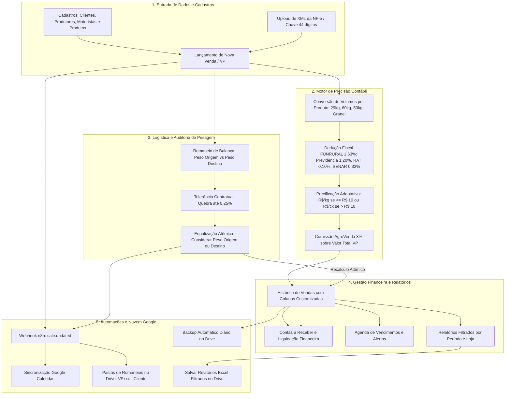

# 🚜 MAPA GERAL DE FLUXO E FUNCIONALIDADES DO SISTEMA (AGROVENDA V2)

**Documento:** Manual Mestre de Arquitetura, Fluxo de Dados e Funcionalidades  
**Sistema:** AgroVenda V2  
**Finalidade:** Base de Conhecimento para Auditoria Geral do Sistema  
**Data:** 31 de Agosto de 2026  
**Versão:** 2.6.0  
**Ambiente:** Produção (Docker / VPS / HTTPS / MongoDB / n8n / Google Workspace)  

---

## 1. 🗺️ VISÃO GERAL DA ARQUITETURA E FLUXO OPERACIONAL

O **AgroVenda V2** é uma plataforma de gestão comercial, fiscal, financeira e logística projetada para o agronegócio, especializada em intermediação de safras, corretagem agrícola, vendas particulares (VP), compras de produtores rurais e auditoria de pesagens rodoviárias.

---

## 2. 🧩 MAPA COMPLETO DE MÓDULOS E FUNCIONALIDADES

---

### MÓDULO 1: Autenticação, Usuários e Segurança (RBAC)
- **Tecnologia:** JWT (JSON Web Tokens) com expiração segura, senhas criptografadas com bcrypt.
- **Perfis de Acesso:**
  - **Administrador:** Acesso total (criação, edição, exclusão, restauração de backups e gestão de usuários).
  - **Operador Comercial:** Lançamento de vendas, romaneios, clientes e relatórios.
  - **Consulta:** Visualização de relatórios e histórico sem permissão de alteração.
- **Auditoria de Sessão:** Controle de expiração e renovação transparente.

---

### MÓDULO 2: Dashboard e KPIs em Tempo Real
- **Métricas Consolidadas:**
  - Faturamento Total Bruto da Safra (R$).
  - Valor Total de VP (Base Comercial de Intermediação).
  - Total Líquido a Receber pelo Produtor.
  - Total de Comissões AgroVenda (3%).
  - Total de FUNRURAL Retido na Fonte (1,63%).
  - Cargas Divergentes em Aberto na Pesagem.
- **Gráficos e Indicadores:** Faturamento mensal por comprador, ranking de lojas e fluxo de liquidação.

---

### MÓDULO 3: Nova Venda Comercial & Leitor de NF-e XML
- **Tipos de Operação Suportados:**
  1. *Intermediação (Corretagem / Comissão)* — Padrão de mercado.
  2. *Venda Particular / Repasse Direto (VP)*.
  3. *Revenda Padrão (Compra e Venda)*.
  4. *Venda de Estoque Próprio*.
- **Leitor de XML de Nota Fiscal:**
  - Upload direto do arquivo `.xml` da SEFAZ.
  - Extração automática da chave de 44 dígitos, data de emissão, CNPJ do destinatário, transportadora, placa do caminhão e valores fiscais.
- **Precificação Adaptativa Multicommodity:**
  - Se a cotação for $\le \text{R\$} 10,00/\text{kg}$ (ex: Cebola a R$ 2,15/kg): Base VP = $\text{Peso (kg)} \times \text{Cotação (R\$/kg)}$.
  - Se a cotação for $> \text{R\$} 10,00/\text{cx}$ (ex: Cenoura a R$ 45,00/cx): Base VP = $\text{Caixas} \times \text{Cotação (R\$/cx)}$.
- **Decomposição Exata do FUNRURAL (1,63%):**
  - Previdência Social: $1,20\%$
  - RAT: $0,10\%$
  - SENAR: $0,33\%$
  - *Líquido a Receber:* $\text{Valor Total NF} - \text{FUNRURAL}$.
- **Prazos de Pagamento e Vencimento Dinâmico:**
  - Presets (À vista, 10, 15, 20, 25, 30, 35, 40, 45, 50, 60 dias).
  - Cálculo automático da Data de Vencimento com calendário e dias úteis.

---

### MÓDULO 4: Logística, Romaneios e Reconciliação de Pesagem
- **Conexão com Balança:** Registro do Peso de Origem (fazenda/embarque) e Peso de Destino (entrega na loja).
- **Auditoria de Quebra Técnica:**
  - Tolerância admitida de até $0,25\%$.
  - Se $\text{Quebra} > 0,25\%$, o status é marcado como `Divergente`.
- **Equalização de Pesos com 1 Clique:**
  - **Opção 1:** *Considerar Peso Destino* $\rightarrow$ Ajusta Peso Origem para o Destino, zera a diferença e marca como `Ajustado`.
  - **Opção 2:** *Considerar Peso Origem* $\rightarrow$ Ajusta Peso Destino para a Origem, zera a diferença e marca como `Ajustado`.
- **Recálculo Atômico em Cascata:**
  - Ao salvar o ajuste, a Venda vinculada (`Sale`) é encontrada automaticamente (`ROM-VP048` $\rightarrow$ `VP048`).
  - O peso da venda, as caixas equivalentes, o valor da NF, o FUNRURAL, o Valor de VP e a comissão de 3% são recalculados e salvos instantaneamente no banco de dados.

---

### MÓDULO 5: Histórico de Negociações & Gestão de Vendas
- **Tabela de Alta Densidade:**
  - Configuração de colunas visíveis salva no `localStorage` do navegador do usuário.
  - Ordenação dinâmica por Código VP, Data, Destinatário, Peso, Valor VP, NF, FUNRURAL, Líquido e Comissão.
- **Exibição Dinâmica de Volumes:**
  - Adaptação por tipo de embalagem cadastrada: `cx eq. (29kg)` para cebola/granel, `cx (29kg)` para cenoura, `sc (60kg)` para milho/soja, `sc (50kg)` para batata, `cx (20kg)` para tomate.
- **Liquidação e Recibos:**
  - Registro de baixa de pagamento (`A Receber` $\rightarrow$ `Recebido`).
  - Emissão de espelho de venda e recibo de produtor.

---

### MÓDULO 6: Módulo de Compras de Produtores
- Gestão de aquisição de matérias-primas e lotes de produtores rurais.
- Controle de valores pagos, saldo a pagar e status de recebimento.

---

### MÓDULO 7: Gestão Financeira, DRE e Fluxo de Caixa
- Visão unificada de Contas a Receber (Clientes) versus Contas a Pagar (Produtores).
- Demonstrativo do Resultado do Exercício (DRE) com apuração de comissões líquidas da corretora.

---

### MÓDULO 8: Agenda Financeira, Google Calendar & Alertas
- **Feed Público/Privado de Eventos:** Endpoint `/api/sales/agenda-events` formatado para integração contínua.
- **Sincronização com Google Calendar:** Exibe cada recebível com data de vencimento, comprador, valor em reais e status de pagamento.

---

### MÓDULO 9: Relatórios Gerenciais & Exportação para o Google Drive
- **Filtragem Multicritério:** Por Comprador/Loja, período de datas inicial e final.
- **Totais em Tempo Real:** Total de quilos, caixas, cotação média ponderada, faturamento e comissões.
- **Exportação para o Google Drive via n8n:**
  - Gera tabela HTML/Excel formatada em Base64 com cabeçalhos e totais idênticos aos filtros da tela.
  - O n8n cria ou localiza a pasta do mês (ex: `Meu Drive > Relatórios > Relatórios AgroVenda (2026-08)`) e faz o upload automático do arquivo `.xls`.

---

### MÓDULO 10: Cadastros Gerais (Catálogo Multicommodity)
- **Clientes Compradores:** Nome fantasia, Razão Social, CNPJ/CPF, Inscrição Estadual, Cidade, UF e dados bancários/PIX.
- **Produtores Rurais:** Documento, dados da fazenda e chave de repasse.
- **Motoristas e Transportadoras:** Nome, CPF, placa do caminhão e tipo de frete (FOB/CIF).
- **Catálogo de Produtos:** Configuração de unidade padrão (`Caixas 29kg`, `Granel kg`, `Sacas 60kg`, `Sacas 50kg`, `Caixas 20kg`, `Caixas 10kg`).

---

### MÓDULO 11: Backup, Restauração & Disaster Recovery
- **Exportação Completa:** Exporta todas as coleções do MongoDB (`sales`, `weighings`, `clients`, `producers`, `purchases`, `products`, `users`) em formato JSON estruturado.
- **Restauração Resiliente:** Aceita tanto dumps brutos de coleções quanto envelopes completos do sistema.
- **Automação de Backup:** Disparo diário para armazenamento redundante no Google Drive.

---

### MÓDULO 12: Infraestrutura, VPS e Integrações em Nuvem
- **Ambiente:** Servidor VPS Ubuntu com Docker Compose.
- **Serviços Ativos:**
  - `agrovendas-app` (Node.js Express + React SPA Vite).
  - `mongodb` (Banco de dados NoSQL com índices B-Tree).
  - `n8n` (Motor de automação de fluxos com SSL dedicado `https://n8n.agrovendas.cloud/`).
  - `nginx` (Proxy reverso HTTPS com certificados Let's Encrypt / Certbot).
- **Segurança OAuth 2.0:** Aplicativo configurado na Google Cloud Platform para tokens permanentes de integração.

---

## 3. 📊 MATRIZ DE RASTREABILIDADE PARA AUDITORIA GERAL

| Módulo | Entidades do Banco | Endpoints Principais | Telas Frontend |
| :--- | :--- | :--- | :--- |
| **Autenticação** | `User` | `POST /api/auth/login`, `/api/auth/me` | `Login.jsx`, `UserManagement.jsx` |
| **Vendas** | `Sale` | `GET /api/sales`, `POST /api/sales`, `PUT /api/sales/:id` | `NewSale.jsx`, `SalesHistory.jsx` |
| **Pesagem** | `WeighingSlip` | `GET /api/weighings`, `PUT /:id`, `PUT /:id/resolve` | `WeighingSlips.jsx` |
| **Compras** | `Purchase` | `GET /api/purchases`, `POST /api/purchases` | `Purchases.jsx` |
| **Cadastros** | `Client`, `Product`, `Producer` | `GET /api/clients`, `/api/products`, `/api/producers` | `Cadastros.jsx` |
| **Agenda** | `Sale` | `GET /api/sales/agenda-events` | `AgendaAlerts.jsx` |
| **Relatórios** | `Sale` | `POST /api/reports/trigger-n8n` | `Reports.jsx` |
| **Backup** | Todas as coleções | `GET /api/backup/export`, `POST /api/backup/restore` | `BackupRestore.jsx` |

---
*Documento Mestre homologado como referência oficial para auditoria operacional, contábil e de segurança da informação.*
