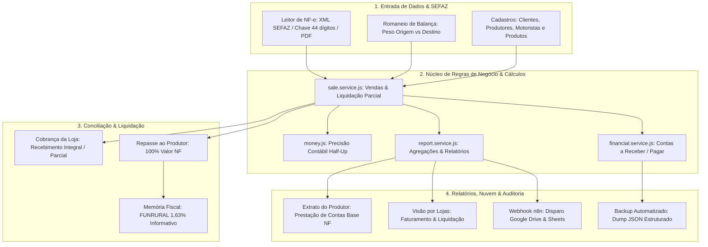

# 🚜 MANUAL MESTRE DE FLUXO, ARQUITETURA E FUNCIONALIDADES (AGROVENDA V2)

**Sistema:** AgroVenda V2  
**Finalidade:** Base de Conhecimento e Dossiê Técnico para Auditoria Contábil, Fiscal e de Software  
**Data da Versão:** 21 de Setembro de 2026  
**Versão Homologada:** 2.8.0  
**Ambiente:** Produção (Docker Compose / Ubuntu VPS / Node.js 20 / MongoDB 7 / Nginx SSL / n8n / Google Workspace)  

---

## 1. 🗺️ VISÃO GERAL DA ARQUITETURA E FLUXO OPERACIONAL

O **AgroVenda V2** é uma plataforma corporativa especializada em gestão comercial, corretagem agrícola, conciliação tributária, liquidação financeira e auditoria de pesagens rodoviárias de safras agrícolas hortifrúti.

### 📐 Arquitetura em Camadas (Service Layer & Clean Architecture)

O sistema é construído sobre uma arquitetura desacoplada em três camadas:
1. **Frontend SPA (React 18 + Vite + TailwindCSS)**: Componentes atômicos modulares, gerenciamento de estado local com memoização (`useMemo`), renderização condicional de tabelas densas e builders de relatórios compatíveis com normas contábeis.
2. **Backend API (Node.js + Express 4)**: Camada de rotas magras (*thin controllers*) delegando processamento para serviços especializados de negócio (`sale.service`, `report.service`, `financial.service`, `dashboard.service`, `cleanup.service`, `sequence.service`, `producer.service`).
3. **Persistência de Dados (MongoDB 7 + Mongoose)**: Armazenamento transacional NoSQL com schemas estritos, validações de integridade, índices B-Tree e coleções de sequenciadores atômicos (`counters`) para geração livre de colisões.

---

## 2. ⚖️ REGRAS DE NEGÓCIO E FÓRMULAS CONTÁBEIS CANÔNICAS

Todas as fórmulas financeiras utilizam a biblioteca interna `money.js`, que previne imprecisões de ponto flutuante IEEE 754 mediante arredondamento Half-Up a duas casas decimais com constante `Number.EPSILON`.

### 2.1. Política de Repasse ao Produtor Rural
* **Princípio Operacional:** A AgroVenda atua como corretora/intermediadora. O valor faturado da operação comercial é **repassado integralmente (100%)** ao Produtor Rural.
* **Valor Total a Repassar:** Corresponde exatamente ao **Valor Total da Nota Fiscal (NF)** emitida pelo produtor:
  $$\text{Total a Repassar} = \text{Total da NF (Bruto)}$$
* **Equação de Caixa do Produtor:**
  $$\text{Total da Operação (NF)} = \text{Total Já Repassado} + \text{Saldo a Repassar}$$

### 2.2. Tratamento do FUNRURAL (1,63%)
* **Natureza Contábil:** O FUNRURAL é discriminado nas telas e relatórios em caráter **exclusivamente informativo** para subsidiar a escrituração contábil e apuração fiscal direta do Produtor Rural (ou da fonte pagadora adquirente, conforme enquadramento tributário).
* **Alíquotas Oficiais Vigentes (Produtor Pessoa Física):**
  * **Previdência Social:** 1,20%
  * **RAT (Riscos Ambientais do Trabalho):** 0,10%
  * **SENAR:** 0,33%
  * **Total Consolidado:** 1,63%
* **Líquido Fiscal Estimado do Produtor:**
  $$\text{Líquido Fiscal Estimado} = \text{Total Faturado NF} - \text{FUNRURAL (1,63\%)}$$

### 2.3. Precificação Comercial (Valor de VP) e Multi-item
* Quando a venda envolve negociação com cotação de mercado ou múltiplos itens (ex.: Cenoura, Batata, Cebola):
  * **Cotação em Quilo (<= R$ 10,00/kg):** Base VP = Peso (kg) x Cotação (R$/kg).
  * **Cotação em Caixa (> R$ 10,00/cx):** Base VP = Volumes (cx) x Cotação (R$/cx).
  * Em vendas multi-item, cada item calcula seu subtotal e o somatório compõe o `valorTotalVP`. Na ausência de negociação comercial divergente, o valor comercial coincide com o valor da NF.

### 2.4. Comissão da Corretora AgroVenda
* Calculada por percentual fixo parametrizado na venda (padrão de 3,0%):
  $$\text{Comissão (R\$)} = \text{Valor Comercial (VP)} \times \left(\frac{\text{Taxa \%}}{100}\right)$$

### 2.5. Liquidação Parcial e Histórico Auditável
* Suporte a múltiplos pagamentos por venda, registrando no array `paymentHistory` (lojas) e `producerPaymentHistory` (produtores):
  * `amount`: Valor monetário da parcela.
  * `date`: Data contábil do pagamento.
  * `paymentMethod`: Método (`PIX`, `Cheque`, `TED/DOC`, `Dinheiro`).
  * `checkNumber`, `checkBank`, `checkDueDate`: Dados bancários quando liquidado em cheque.
  * `paymentProofFile`: Caminho do comprovante anexado.
  * `notes`: Justificativa ou notas do operador.
* **Status de Liquidação:**
  * $\text{Pago} = 0 \rightarrow \mathbf{A\ Receber\ /\ A\ Pagar}$
  * $0 < \text{Pago} < \text{Total} \rightarrow \mathbf{Parcial}$
  * $\text{Pago} \ge \text{Total} - 0,05 \rightarrow \mathbf{Liquidado\ /\ Quitado}$

---

## 3. 🧩 MAPA DETALHADO DOS MÓDULOS DO SISTEMA

---

### MÓDULO 1: Vendas e Faturamento (VPs e NF-e)
* **Objetivo:** Registro central de todas as cargas expedidas e faturadas.
* **Componentes Principais:**
  * `NewSale.jsx`: Formulário de lançamento com suporte a importação de XML da SEFAZ, chave de 44 dígitos anti-duplicidade, validação de pesos e cálculo em tempo real.
  * `SalesHistory.jsx`: Grade analítica de alta performance com paginação, busca dinâmica, personalização de colunas no `localStorage` e modais integrados de edição e liquidação.
* **Integridade:** Geração de código sequencial atômico (`VP001`, `VP002`...) pelo serviço `sequence.service.js`, impedindo saltos ou duplicidades em concorrência.

---

### MÓDULO 2: Logística e Auditoria de Pesagem (Romaneios)
* **Objetivo:** Confronto entre o peso de embarque na fazenda (Origem) e o peso de chegada no cliente (Destino).
* **Regra de Quebra Técnica:**
  * Tolerância contratual padrão: 0,25%.
  * Se Diferença > 0,25%, a pesagem é classificada como **Divergente**.
* **Equalização de Pesos em 1 Clique:**
  * O operador pode equalizar considerando o peso de destino ou o peso de origem.
  * A equalização dispara a atualização automática da venda vinculada, recalculando caixas, valor da NF e comissões.

---

### MÓDULO 3: Agenda e Gestão de Vencimentos
* **Objetivo:** Controle de fluxo de caixa em duas esteiras operacionais independentes:
  1. **Aba Cobrança de Clientes:** Monitora vencimento dos recebíveis das lojas compradoras.
  2. **Aba Repasses a Produtores:** Monitora prazos e transferências devidas aos produtores rurais, equipada com filtro avançado por **Loja Destino**.
* **Recursos:** Baixa assistida via `SettleModal.jsx`, cálculo dinâmico de juros/descontos, estorno de baixas e download de comprovantes.

---

### MÓDULO 4: Relatórios e Prestação de Contas (Reports)
Apresenta três visões analíticas especializadas e modulares:

1. **Aba Extrato do Produtor (`ProducerSummaryTable.jsx` e `ProducerDetailList.jsx`):**
   * Prestação de contas estrita sobre as notas fiscais do produtor rural.
   * Total da Operação (NF), Total Já Repassado, Saldo a Repassar, FUNRURAL (1,63% Informativo) e Líquido Fiscal Estimado.
   * Nota contábil de esclarecimento tributário impressa automaticamente no rodapé.
2. **Aba Visão por Lojas (`StoreSummaryTable.jsx` e `StoreDetailList.jsx`):**
   * Desempenho de vendas por comprador.
   * Total Faturado, FUNRURAL discriminado, Valor Liquidado e Valor a Liquidar em perfeita simetria com os repasses.
3. **Aba Lucros do Corretor (`BrokerProfitTable.jsx`):**
   * Demonstrativo do fechamento operacional da AgroVenda (comissões brutas, deduções operacionais e resultado líquido).
4. **Exportação Google Drive & n8n (`reportExcelBuilder.js`):**
   * Geração de planilhas Excel formatadas (.xls) espelhando o layout visual do PDF, suprimindo colunas internas confidenciais (Total Comercial e Valor Total VP) para envio a clientes e produtores.

---

### MÓDULO 5: Financeiro, DRE e Fiscal
* **Serviço:** `financial.service.js`.
* **Consolidação:** Monitora montantes a liquidar, títulos vencidos por faixa de atraso e conciliação centavo a centavo das guias previdenciárias de FUNRURAL.

---

### MÓDULO 6: Segurança, Autenticação e Backup
* **Autenticação:** Baseada em Bearer Tokens JWT validados pelo middleware `auth.js`.
* **Disaster Recovery (`backup.routes.js`):** Rotinas completas de exportação e restauração de snapshots do MongoDB em formato JSON estruturado com tolerância a falhas.

---

## 4. 🗄️ MODELAGEM DE DADOS (SCHEMAS MONGOOSE)

### Entidade Principal: `Sale` (`backend/models/Sale.model.js`)

| Campo | Tipo | Descrição |
| :--- | :---: | :--- |
| `id` | String | Código único sequencial da venda (ex.: `VP001`, indexado e único) |
| `saleDate` | String | Data da negociação no padrão ISO `YYYY-MM-DD` |
| `client` | String | Nome fantasia / Razão social da loja compradora |
| `origin` | String | Produtor rural de origem padronizado |
| `totalOperation` | Number | **Valor Total Bruto da Nota Fiscal (NF)** |
| `totalKg` | Number | Peso total faturado em quilogramas |
| `totalVolumes` | Number | Quantidade total de caixas / sacas |
| `dailyQuote` | Number | Cotação comercial aplicada |
| `valorTotalVP` | Number | Valor comercial consolidado da operação |
| `feeValue` | Number | Taxa de comissão percentual da corretora (ex.: 3.0) |
| `funruralTotal` | Number | Valor consolidado do FUNRURAL (1,63%) |
| `previdenciaSocial` | Number | Parcela de Previdência Social (1,20%) |
| `rat` | Number | Parcela de Riscos do Trabalho (0,10%) |
| `senar` | Number | Parcela do Fundo SENAR (0,33%) |
| `paidAmount` | Number | Valor acumulado recebido da loja |
| `paymentStatus` | String | Status de recebimento (`A Receber`, `Parcial`, `Recebido`) |
| `paymentHistory` | Array | Histórico auditável de parcelas pagas pela loja |
| `producerPaidAmount` | Number | **Valor acumulado já transferido/repassado ao produtor** |
| `producerPaymentStatus`| String | Status de repasse (`A Pagar`, `Parcial`, `Pago`) |
| `producerPaymentHistory`| Array | Histórico auditável de parcelas repassadas ao produtor |
| `dueDate` | String | Data de vencimento contábil |
| `nfeKey` | String | Chave de 44 dígitos da NF-e SEFAZ |
| `nfFile` | String | Nome do arquivo PDF da Nota Fiscal armazenado |

---

## 5. 🔍 CHECKLIST E PONTOS DE CONTROLE PARA AUDITORIA EXTERNA

Ao auditar o sistema AgroVenda V2, o auditor técnico/contábil deve verificar os seguintes pontos de controle:

1. **Conciliação de Caixa de Repasses:**
   * Certificar que para qualquer produtor e período:
     $$\sum \text{repassesPagos} + \sum \text{saldoAPagar} = \sum \text{valorTotalNF}$$
2. **Memória de Cálculo de FUNRURAL:**
   * Conferir se a retenção informativa de FUNRURAL respeita rigorosamente:
     $$\text{funruralTotal} = \text{totalOperation} \times 0,0163 = \text{previdencia} (1,20\%) + \text{rat} (0,10\%) + \text{senar} (0,33\%)$$
3. **Prevenção de Duplicidade de Faturamento:**
   * Verificar se o índice único em `nfeKey` impede a inserção de notas duplicadas.
4. **Rastreabilidade de Comprovantes:**
   * Inspecionar o diretório `/uploads` e verificar se os hashes de arquivos vinculados às vendas conferem com os registros de `paymentHistory` e `producerPaymentHistory`.
5. **Logs e Integridade dos Containers:**
   * Validar a integridade da rede Docker interna (`agrovenda_v2_network`), onde o MongoDB expõe apenas a porta para a rede de aplicação, sem portas abertas desnecessárias na Internet pública.

---

*Documento técnico homologado em 21/09/2026 como especificação oficial do sistema AgroVenda V2 para instrução de auditorias contábeis, operacionais e de tecnologia da informação.*
