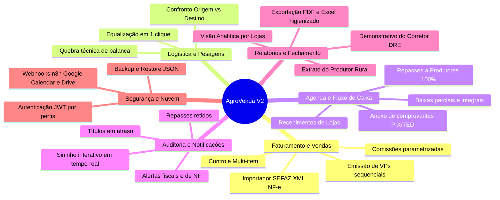

# 🚜 MANUAL DE FUNCIONALIDADES DO SISTEMA AGROVENDA V2

**Plataforma:** AgroVenda V2 — Sistema de Gestão, Faturamento e Corretagem Agrícola  
**Versão:** 2.8.0  
**Data:** 22 de Setembro de 2026  
**Ambiente:** Produção (Docker Compose / Node.js API / MongoDB 7 / React Vite / n8n / Google Workspace)  

---

## 📌 SUMÁRIO EXECUTIVO

O **AgroVenda V2** é uma solução corporativa completa desenvolvida sob medida para o agronegócio, especializada na **comercialização hortifrúti, corretagem e intermediação agrícola, auditoria de pesagem rodoviária e liquidação financeira segregada** entre produtores rurais e redes de supermercados/varejo.

---

## 1. 📊 DASHBOARD GERENCIAL (VISÃO EXECUTIVA)

O Dashboard centraliza em tempo real a saúde financeira e comercial das operações da safra.

* **Filtro por Período Flexível:** Seleção por datas inicial e final para recálculo instantâneo de todos os indicadores.
* **Indicadores Chave de Desempenho (KPIs):**
  * **Vendas do Período:** Quantidade total de VPs comercializadas no intervalo.
  * **Total Faturado (NF):** Montante global emitido em notas fiscais.
  * **Total a Receber:** Saldo pendente de liquidação das lojas compradoras.
  * **Total a Pagar ao Produtor:** Montante em aberto para transferência aos fornecedores rurais.
  * **Lucratividade / Comissões:** Receita líquida obtida pela corretora AgroVenda nas intermediações.
  * **Quebra de Peso Global:** Percentual médio de perda rodoviária entre embarque e desembarque.
* **Cards de Alerta Crítico:**
  * **Títulos Vencidos:** Valores vencidos que demandam cobrança ativa.
  * **Notas Pendentes:** Vendas expedidas com faturamento de NF pendente.
  * **Romaneios Divergentes:** Pesagens com quebra acima da tolerância contratual (0,25%).
* **Gráfico de Evolução (Últimos 7 Dias):** Comparativo visual do volume de faturamento dia a dia.
* **Tabela de Transações Recentes:** As últimas operações registradas com links diretos para detalhes, status e comprovantes.

---

## 2. 🔔 CENTRAL DE NOTIFICAÇÕES & AUDITORIA INTELIGENTE

Motor de auditoria ativa executado no backend (`audit.service.js`) que monitora continuamente inconformidades e riscos operacionais.

* **Sininho Interativo na Topbar:** Badge numérico em tempo real com indicador visual pulsante para pendências críticas.
* **As 4 Categorias de Alertas de Auditoria:**
  1. **Repasses Pendentes ao Produtor:** Detecta operações em que a loja compradora já pagou a AgroVenda, mas o repasse devido ao produtor rural ainda não foi liberado.
  2. **Inadimplência de Lojas:** Identifica faturas de clientes que ultrapassaram a data de vencimento sem registro de quitação.
  3. **Pendências Fiscais e Documentais:** Alerta vendas realizadas há mais de 48 horas sem o preenchimento do número da NF ou sem o anexo do arquivo em PDF.
  4. **Inconsistências de Cotação e Pesagem:** Aponta vendas com cotação comercial zerada ou romaneios de balança com quebra de peso acima de 0,25%.
* **Ação Direta em 1 Clique:** Cada item de notificação contém um botão de ação rápida que direciona o operador exatamente para a tela e registro com inconformidade.

---

## 3. 🌾 FATURAMENTO E NOVAS VENDAS (VPs & NF-e)

Módulo principal de entrada operacional, garantindo integridade documental e matemática.

* **Sequenciador Automático e Atômico:** Geração de códigos de venda únicos e auditáveis (`VP001`, `VP002`...) pelo serviço `sequence.service.js`, garantindo que não existam saltos ou duplicidades em concorrência.
* **Leitor Inteligente de NF-e (XML da SEFAZ):**
  * Upload do arquivo XML ou digitação da **Chave de Acesso de 44 dígitos**.
  * Validação anti-duplicidade em banco (impede faturar a mesma NF duas vezes).
  * Auto-preenchimento instantâneo: Produtor/Origem, Loja Destino, número da NF, peso líquido em kg, quantidade de caixas, preço unitário e valor total.
* **Os 4 Modelos de Operação Comercial:**
  1. `Revenda Padrão (Compra e Venda)`: Aquisição e faturamento próprio da mercadoria.
  2. `Intermediação (Corretagem / Comissão)`: Intermediação entre produtor rural e rede de varejo com comissão percentual ou fixa.
  3. `Venda Particular / Repasse Direto`: Comercialização direta repassada ao produtor com retenções acordadas.
  4. `Venda de Estoque Próprio`: Expedição de produtos próprios armazenados.
* **Suporte Multi-item Dinâmico:** Capacidade de faturar cargas mistas na mesma VP (ex.: Cenoura, Batata, Cebola) com caixas, pesos e cotações individuais calculados com subtotal em tempo real.
* **Cálculo de Precisão Contábil (`money.js`):**
  * Elimina erros de ponto flutuante usando arredondamento Half-Up com `Number.EPSILON`.
  * Conversão automática de caixas em kg (padrão de 29 kg/cx ou parametrizável).
  * Regra de cotação inteligente: em quilo (quando $\le \text{R\$} 10,00/\text{kg}$) ou em caixa (quando $> \text{R\$} 10,00/\text{cx}$).
* **Tratamento Tributário do FUNRURAL (1,63%):**
  * Detalhamento oficial: Previdência Social (1,20%), RAT (0,10%) e SENAR (0,33%).
  * Apresentado de forma clara e **informativa** para a escrituração do produtor rural.
* **Gestão Documental de Anexos:** Armazenamento seguro de arquivo da NF (PDF/XML), comanda de carregamento e ordens de compra.

---

## 4. 📜 HISTÓRICO DE VENDAS & CONTROLE DE CONTRATOS

Grade analítica detalhada com ferramentas de gestão avançada para auditoria de todas as vendas já realizadas.

* **Filtros Combinados:** Pesquisa rápida por código VP, número da NF, loja compradora, produtor rural de origem, faixa de datas e status de liquidação.
* **Personalização de Colunas:** O operador pode ocultar ou exibir colunas conforme sua preferência, com persistência no `localStorage` do navegador.
* **Modal de Edição Completa:** Permite ajustes de cotações, complementação de números de notas e reanálise de pesos.
* **Impressão de Contrato / Comprovante de Operação (`ContractModal.jsx`):** Gera em tela o contrato comercial formatado com termos de intermediação, valores e prazos, pronto para impressão ou envio por e-mail/WhatsApp.
* **Visualizador de Evidências:** Permite abrir e inspecionar comprovantes de pagamento e notas fiscais em pop-up sem sair da tela.

---

## 5. ⚖️ LOGÍSTICA & AUDITORIA DE PESAGEM (ROMANEIOS DE BALANÇA)

Módulo voltado à conciliação e conferência de peso de transporte rodoviário.

* **Confronto Origem vs Destino:**
  * **Peso de Origem:** Apurado na balança rodoviária da fazenda / cooperativa.
  * **Peso de Destino:** Apurado na balança da loja / centro de distribuição do cliente.
* **Cálculo da Quebra Técnica:**
  $$\text{Diferença (kg)} = \text{Peso Origem} - \text{Peso Destino}$$
  $$\text{Quebra \%} = \left(\frac{\text{Diferença}}{\text{Peso Origem}}\right) \times 100$$
* **Tolerância Parametrizada (0,25%):**
  * $\le 0,25\%$: Quebra considerada aceitável por perda natural de umidade no transporte (*Status: Normal*).
  * $> 0,25\%$: Romaneio sinalizado como irregular (*Status: Divergente*).
* **Equalização em 1 Clique:**
  * Permite ao gestor equalizar a carga considerando o Peso de Origem ou o Peso de Destino.
  * A equalização **recalcula automaticamente** a venda correspondente (caixas equivalentes, valor total da NF e comissão da corretora).
* **Anexo do Ticket de Balança:** Upload de fotos ou PDFs dos tickets emitidos pelas balanças rodoviárias.

---

## 6. 📅 AGENDA & ALERTAS FINANCEIROS (FLUXO DE CAIXA SEPARADO)

Gestão segregada entre Contas a Receber e Contas a Pagar, equipada com recursos de alta usabilidade para navegação confortável em grandes volumes de lançamentos.

### Aba 1: 📥 Recebimentos de Lojas (Contas a Receber)
* Monitoramento de vencimentos das lojas compradoras.
* Exibição do **Total Faturado NF**, **Total VP**, **Valor Já Recebido** e **Saldo a Receber**.
* Botão **Receber (+)**: Baixa assistida total ou parcial via `SettleModal.jsx` com registro de forma de pagamento (PIX, TED, Cheque, Dinheiro) e anexo de comprovante.
* Histórico completo de liquidações parciais com possibilidade de estorno/reversão em caso de erro.

### Aba 2: 📤 Repasses a Produtores (Contas a Pagar)
* **Regra de Negócio Canônica (100% de Repasse):** O produtor rural recebe **100% do valor da NF**. O FUNRURAL (1,63%) é destacado com caráter estritamente informativo.
* **Status da Loja em Tempo Real na Coluna Loja Destino:**
  * `✓ Loja Pagou` (verde)
  * `Loja: Parcial` (azul)
  * `⏳ Loja: A Receber` (âmbar)
  * Permite ao operador saber se a loja já liquidou o pedido antes de efetuar a transferência bancária ao produtor.
* **Botão Repassar (+)**: Baixa de repasse bancário ao produtor com comprovante PIX/TED anexado.
* **Filtros Avançados:** Filtro conjunto por Produtor de Origem e Loja Destino.

### 🌟 Recursos de Usabilidade de Alta Densidade da Agenda
* **Rolagem Horizontal Sempre Visível:** A barra de rolagem horizontal fica colada na base visível da tabela, sem necessidade de rolar 48 linhas até o rodapé da página.
* **Cabeçalho Sticky (`sticky top-0 z-20`):** Os títulos das colunas permanecem fixos ao rolar verticalmente pelos lançamentos.
* **Botões de Rolagem Lateral Rápida `[◀ Início]` e `[Ações ▶]`:** Permitem deslizar a tabela suavemente até a coluna de ações com 1 único clique.
* **Recolher / Expandir Cards de Resumo (`[Ocultar Resumo]` / `[Ver Resumo]`):** Permite recolher os cards de KPIs do topo para expandir a tabela em quase 100% da altura da tela.
* **Sincronização Geral (`⚡ Sincronizar Tudo`):** Dispara todos os eventos de agenda para o Google Calendar e Google Drive via n8n.

---

## 7. 📈 RELATÓRIOS, EXTRATOS & PRESTAÇÃO DE CONTAS

Módulo de inteligência gerencial e prestação de contas externa para produtores e compradores.

### 1. Extrato do Produtor Rural (`ProducerSummaryTable.jsx` & `ProducerDetailList.jsx`)
* Instrumento oficial de prestação de contas das notas fiscais do produtor.
* Apresenta:
  * Total da Nota Fiscal (100% repassado).
  * Total já repassado e saldo em aberto.
  * FUNRURAL destacado (1,63% informativo) e Líquido Fiscal Estimado.
* **Nota Explicativa de Rodapé:** Impressa automaticamente esclarecendo a base tributária.
* Agrupamento consolidado por produtor ou analítico detalhado linha a linha por carga.

### 2. Visão por Lojas (`StoreSummaryTable.jsx` & `StoreDetailList.jsx`)
* Demonstrativo comercial por cliente comprador.
* Confronto entre faturamento faturado, recebimentos parciais e títulos a vencer.

### 3. Lucros do Corretor (`BrokerProfitTable.jsx`)
* Demonstrativo operacional interno da AgroVenda.
* Total de comissões auferidas, volumes comercializados e ticket médio das safras.

### 4. Exportação Profissional
* **Exportação em PDF:** Diagramação limpa e profissional para impressão ou envio por e-mail.
* **Exportação em Excel (.xls):** Planilhas formatadas que espelham exatamente a estrutura visual do relatório, com supressão de dados estratégicos internos para envio externo.
* **Integração Google Drive via n8n:** Botão direto para salvar relatórios gerados em pastas estruturadas no Google Drive da empresa.

---

## 8. 💰 FINANCEIRO & DRE OPERACIONAL

* **Painel Financeiro Consolidado (`Financial.jsx`):**
  * Demonstrativo de Resultados do Exercício (DRE) com receitas de corretagem, custos operacionais e resultado líquido.
  * Mapa de liquidez de curto prazo com projeção de recebimentos vs pagamentos.
  * Relatório de conciliação das retenções fiscais de FUNRURAL para suporte à contabilidade externa.

---

## 9. 📦 GESTÃO DE COMPRAS E INSUMOS

* Módulo dedicado (`Purchases.jsx`) ao controle de aquisições operacionais:
  * Compra e devolução de caixas plásticas de transporte.
  * Contratação de fretes rodoviários complementares.
  * Registro de insumos agrícolas vinculados aos carregamentos.

---

## 10. 🗃️ CADASTROS GERAIS

Central unificada de cadastros mestres com validações de unicidade:
* **Clientes / Redes de Lojas:** Razão Social, CNPJ/CPF, Inscrição Estadual, endereço completo, prazos médios de faturamento e contatos.
* **Produtores Rurais:** Identificação da Fazenda/Origem, CPF/CNPJ, município, dados bancários e chaves PIX para liquidação ágil.
* **Produtos Agrícolas:** Variedades hortifrúti (Cenoura, Batata, etc.), fator de conversão de caixas para quilos e parâmetros de quebra técnica.
* **Motoristas e Transportadoras:** Dados de habilitação (CNH), placas do cavalo e carreta e contato telefônico.

---

## 11. 👥 GESTÃO DE USUÁRIOS & PERMISSÕES

* **Controle de Acesso Baseado em Perfis (RBAC):**
  * `Administrador`: Acesso total a configurações, cadastros, edição de vendas e rotinas de backup.
  * `Operador`: Emissão de vendas, conferência de pesagens e visualização de históricos.
  * `Financeiro`: Acesso restrito a liquidações, agenda, extratos bancários e relatórios.
* **Segurança:** Criptografia de senhas com `bcryptjs` e emissão de tokens seguros JWT.

---

## 12. 🔄 BACKUP, RESTORE & DISASTER RECOVERY

* **Exportação de Snapshots do Banco de Dados:** Gera dumps completos em formato JSON com todos os documentos de vendas, pesagens, cadastros e usuários.
* **Restauração Assistida com Validação:** Permite subir arquivos de backup restaurando a integridade do MongoDB com validação prévia de esquema.
* **Rotinas Automáticas na Nuvem:** Workflows configurados via n8n para backup periódico automatizado no Google Drive da empresa.

---

## 13. 🌐 INTEGRAÇÕES N8N & GOOGLE WORKSPACE

* **Google Calendar (`n8n_agrovenda_google_calendar.json`):** Criação automática de eventos na agenda corporativa com alertas nos dias de vencimento de títulos e repasses.
* **Google Drive Backup & Arquivos (`n8n_agrovenda_webhook_pastas_drive.json`):** Organização inteligente de pastas em nuvem separadas por Ano / Mês / Produtor para arquivamento dos comprovantes bancários e NFs.
* **Google Sheets:** Espelhamento automático de vendas para planilhas gerenciais de apoio.

---

## 📋 MATRIZ DE COMPONENTES E ROTAS DO SISTEMA

| Módulo | Tela Frontend | Rotas Backend (API) | Serviços de Negócio |
| :--- | :--- | :--- | :--- |
| **Dashboard** | `Dashboard.jsx` | `/api/dashboard` | `dashboard.service.js` |
| **Notificações** | `NotificationBell.jsx` | `/api/notifications/alerts` | `audit.service.js` |
| **Nova Venda** | `NewSale.jsx` | `/api/sales`, `/api/upload` | `sale.service.js`, `nfeParser.service.js` |
| **Histórico Vendas**| `SalesHistory.jsx` | `/api/sales`, `/api/sales/:id` | `sale.service.js`, `sequence.service.js`|
| **Pesagens / Balança**| `WeighingSlips.jsx` | `/api/weighings` | `weighings.routes.js`, `sale.service.js` |
| **Agenda Financeira**| `AgendaAlerts.jsx` | `/api/sales/:id/settle`, `/sync` | `financial.service.js`, `webhook.service.js`|
| **Relatórios** | `Reports.jsx` | `/api/reports/producers`, `/stores`| `report.service.js`, `money.js` |
| **Financeiro / DRE** | `Financial.jsx` | `/api/financial/summary` | `financial.service.js` |
| **Cadastros** | `Cadastros.jsx` | `/api/clients`, `/api/products` | `producer.service.js`, `product.service.js`|
| **Compras** | `Purchases.jsx` | `/api/purchases` | `purchases.routes.js` |
| **Usuários** | `UserManagement.jsx` | `/api/users`, `/api/auth` | `auth.routes.js`, `users.routes.js` |
| **Backup / Restore** | `BackupRestore.jsx` | `/api/backup/export`, `/import` | `backup.service.js` |

---

*Manual elaborado e homologado para a documentação técnica, operacional e fiscal do sistema AgroVenda V2.*
